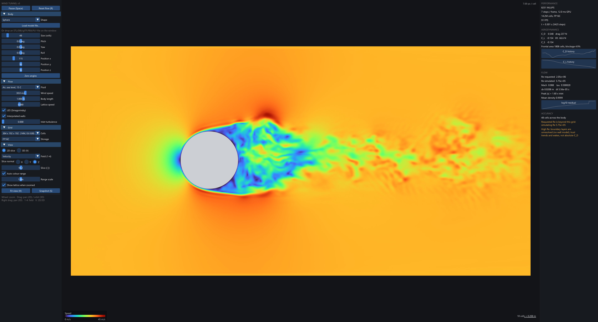
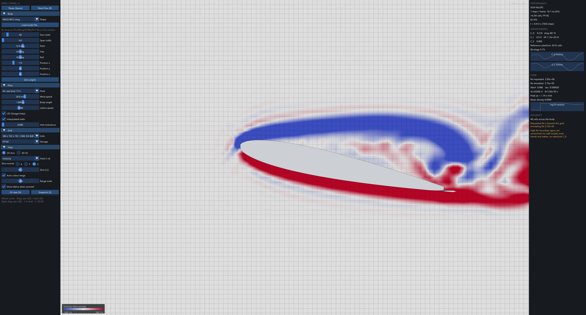
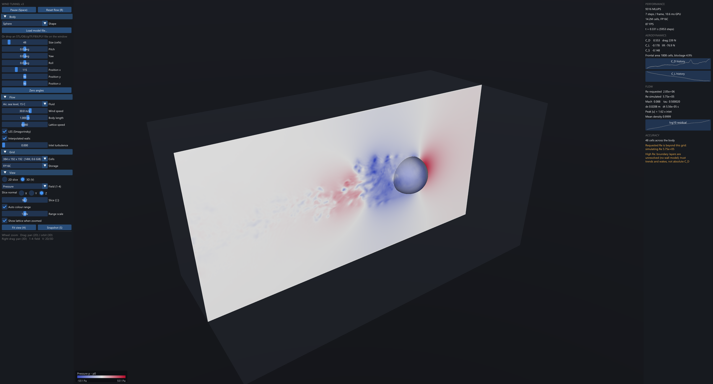

<div align="center">


<br /><br />

# Wind Tunnel v3

**A real-time GPU wind tunnel: D3Q19 lattice Boltzmann in Vulkan compute**

</div>

---

Put a body in the tunnel (sphere, cube, cylinder, NACA 0012 wing, or any
STL/OBJ/glTF/FBX/PLY model), set the wind, and watch the flow develop live.
Rotate the body while the solver runs. Zoom into any part of the flow: the
viewport is drawn per screen pixel straight from the simulation, so zooming in
shows the lattice's real detail instead of magnified texels.

On an RTX 5070 Ti the solver sustains **9,200 to 9,300 million lattice updates
per second** with 16-bit storage, about 80% of the card's memory bandwidth, and
fits up to ~300 million cells in 16 GB.

v3 is a ground-up rewrite. Only the idea carries over from v2.



## Performance

`WindTunnel --bench --peak 896`, 256³ cells, sphere obstacle, RTX 5070 Ti:

| storage | MLUPS | effective bandwidth | % of 896 GB/s |
|---|---|---|---|
| FP32  | 4,780 | 731 GB/s | 82% |
| FP16S | 9,180 | 707 GB/s | 79% |
| FP16C | 9,257 | 713 GB/s | 80% |

Throughput is flat with grid size: FP16C runs at 9,215 MLUPS on
1024 x 448 x 448 (205M cells) and 9,241 on 1024 x 512 x 512 (268M cells).

In the interactive app, rendering, force sums and statistics included
(`--capture` reports this sustained rate):

| grid | sustained | display |
|---|---|---|
| 384 x 192 x 192 | 9,021 MLUPS | 24 FPS |
| 640 x 320 x 320 | 9,258 MLUPS | 24 FPS |
| 1024 x 448 x 448 | 8,760 MLUPS | 21 FPS |

Each frame packs as many steps as fit 40 ms of GPU time while you watch and
14 ms while you pan, zoom or drag a slider, so the display stays smooth when
it matters and the solver gets the GPU otherwise. Every frame also writes
the render field, sums forces and renders, worth up to a quarter of a step;
at the earlier fixed 14 ms budget (and a step counter that truncated) the
big grids ran one step per frame and lost 12-24% to it (6,993 to 8,136 MLUPS).
The default lattice speed is 0.1 (was 0.08), so each step also covers 25%
more physical time; see Accuracy.

Bandwidth counts what each cell must move per step: its 19 distributions read
and written once, plus a flag byte (153 B in FP32, 77 B in FP16).

For reference, FluidX3D, the fastest open single-GPU LBM code, publishes
10,304 MLUPS (FP16C) for the RTX 5080. Scaled by memory bandwidth to the
5070 Ti that is about 9,600. That comparison is an estimate (FluidX3D was not
run on this machine), and FluidX3D's default collision is plain BGK, while
this solver runs a recursive-regularized collision with LES in the same
budget.

**Memory:** 49 bytes per cell in FP16 (87 in FP32), so the largest preset,
1024 x 512 x 512 = 268M cells, needs 12.2 GiB.

### Where the speed comes from

- **In-place streaming (Esoteric-Pull, Lehmann 2022).** One copy of the
  distributions instead of two: half the memory, the same traffic per step.
- **16-bit storage, 32-bit arithmetic.** Distributions are stored shifted
  (f - w) in IEEE half (FP16S) or a custom 1-4-11 format (FP16C), halving the
  bytes per step. Validation below shows the coefficients barely move.
- **Bounce-back for free.** A solid cell never runs, so the slot a fluid cell
  wrote its wall-bound population into is untouched; reading it with the step
  parity flipped returns it reversed one step later. That is exact halfway
  bounce-back, and the same bookkeeping supports interpolated (Bouzidi) walls
  with no races: the q < 1/2 blend happens at load time, the q >= 1/2 blend
  at store time, each using only local data.
- **Compile-time step parity.** Each direction lives in its own buffer (so
  grids can exceed Vulkan's 4 GiB per-binding limit), and the parity decides
  which buffer each access uses. Making the parity a specialization constant
  turned every access into a fixed binding: registers fell from 80 to 47.
- **No divergent boundary branch.** Inlet, far-field and outlet cells run the
  same code as every other cell, with density, velocity and stress overridden
  so the collision yields the equilibrium. A separate branch made any warp
  holding a face cell execute both paths; removing it took FP16 from 52% to
  80% of peak.

## Physics

- **Lattice:** D3Q19, single-step stream + collide kernel.
- **Collision:** recursive regularized BGK (Coreixas et al. 2017) with the six
  third-order Hermite terms D3Q19 supports. The non-equilibrium part is
  rebuilt from the stress tensor, which filters ghost modes.
- **Laminar and turbulent flow:** a *Flow model* setting. *Laminar* solves
  the Navier-Stokes equations directly with no turbulence model, up to the
  Reynolds number the grid resolves; past it a direct simulation diverges
  within a few hundred steps (every body, from 1 m/s up), so Laminar runs
  that Re instead and says so. *Turbulent*
  adds Smagorinsky LES for eddies smaller than a cell. *Auto* (default) turns
  LES on only above the Reynolds number the grid can resolve, Re > (2 L/dx)^(4/3)
  from the Kolmogorov scale (about 440 for a 48-cell body). Both halves of
  that rule are measured, not assumed: in laminar channel flow the
  Smagorinsky model adds 4-10% spurious viscosity at low tau, and on a
  turbulent cylinder at Re 3900 running without it diverges.
- **Fluid properties from temperature and pressure:** air and CO2 as ideal
  gases (density p/RT, Sutherland viscosity, speed of sound sqrt(gamma R T)),
  water from the Thiesen, Vogel and Marczak correlations with its boiling
  point at the set pressure. An ISA altitude slider sets both for air. These
  set the Reynolds and Mach numbers and every dimensional output (forces in
  N, pressures in Pa or absolute kPa, stagnation temperature). The flow
  itself is isothermal and incompressible: temperature enters through the
  fluid's properties, heat transfer is not simulated.
- **Walls:** halfway or Bouzidi interpolated bounce-back from a signed
  distance field, so curved walls sit at their true sub-cell position.
- **Tunnel:** equilibrium inlet (optional perturbation), far-field side faces
  or periodic, pressure outlet pinned at rho = 1.
- **Forces:** momentum exchange summed inside the step kernel on demand.
  Coefficients use planform area (chord x span) for the wing and projected
  frontal area for every other body.
- **Geometry:** voxelized on the GPU as a signed distance field. Analytic
  bodies are exact in any rotation; meshes use a narrow-band distance splat
  plus ray-parity inside/outside. Rotating the body re-voxelizes in
  milliseconds and keeps the running flow; uncovered cells are revived from
  their neighbours' populations.

## Viewport

- **2D slice** along any axis, pan and unlimited zoom. Every pixel samples
  the 3D field. Scalars are trilinearly interpolated; vorticity and the
  Q-criterion are computed at cell centres by central differences, then
  interpolated, so they stay smooth when magnified. The body outline comes
  from the signed distance field with per-pixel anti-aliasing and stays crisp
  at any zoom. Past ~12 px per cell the lattice grid fades in, so you can see
  the actual resolution you are looking at.
- **3D view:** orbit camera, the slice plane in place, the body sphere-traced
  from the SDF and shaded (coloured by surface pressure in pressure mode).
- **Fields:** velocity, pressure, vorticity, Q-criterion, with a colour bar
  and scale bar in physical units.





## Real-time mode

Tick *Real time* and the simulated clock runs with the wall clock: the air
crosses the model at its actual speed. That takes U N / (u L) steps per
second (N cells along a body of length L, lattice speed u), each updating
the whole tunnel, so the mode trades resolution for speed:

- the tunnel is fitted around the body (one length upstream, three
  downstream, 1.5 body sizes of clearance across, about 5% blockage)
  instead of the presets' 2:1:1 box, which for a car needs about 20x fewer cells;
- the resolution is the finest the GPU sustains in real time with a quarter
  of it left for rendering, re-planned from the measured speed if it falls
  behind;

On an RTX 5070 Ti, a 5.6 m F1 car model at 30 m/s runs in real time with 64
cells along the car (352 x 64 x 92 tunnel, dx = 8.7 cm); a 1 m sphere at
30 m/s gets 22 cells across. Faster or smaller bodies get fewer cells, and
the accuracy panel says when that drops below the 32 cells forces need.

## Imported models

- **Orientation:** models are turned so the wind blows along their length:
  up follows the format's convention (Y for glTF, FBX, OBJ, Collada; Z for
  STL, PLY, 3MF), and the front (+Z in glTF, which defines it) faces
  upstream. Yaw 180 if a model faces backwards.
- **Size:** glTF is in metres by specification, so its real length is used
  for the Reynolds number and forces; other formats keep the length slider.
- **Closed vs open meshes:** a watertight mesh is voxelized exactly (inside
  and outside by ray parity, validated against exact shapes). Visualisation
  models rarely are: separate parts, gaps between panels, single-sheet
  wings. Those are shrink-wrapped instead: every cell within 0.87 cells of a
  triangle becomes wall, a flood fill marks what the outside air reaches,
  and the rest is interior. That seals gaps and gives sheets thickness, at
  the price of moving surfaces outward by 0.87 cells. `--mesh-info FILE`
  lists a model's parts and reports which path it takes.

## Validation: is it physically accurate?

Three layers of checks, each exiting 0/1. Every coefficient below is raw: no
blockage or other correction is applied.

### 1. The code does what the equations say (`--selftest`)

The GPU solver against a double-precision CPU reference written the textbook
way (two buffers, plain pull streaming, bounce-back spelled out), on a
sphere, a pitched cube with one-cell gaps and a pitched NACA 0012, with
inlet, outlet and LES active. FP32 agrees to 6e-8 in velocity and 2e-6 in
force (float round-off); a deliberately broken bounce-back fails it by four
orders of magnitude. Also: mesh voxelization against exact shapes (all
misclassified cells within 0.02 cells of the surface), and the fluid
property models against reference tables (air exact to the ISA, water and
CO2 within 1%).

### 2. The physics model against exact solutions (`--validate laminar`)

Laminar flows whose answers are known exactly, in FP32:

| test | what it checks | result |
|---|---|---|
| Shear wave carried at U = 0, 0.05, 0.1 | viscosity under advection (Galilean invariance) | viscosity within 0.25%, advection speed within 0.07% |
| Stokes' first problem | viscous diffusion along a wall | within 1.2% of U erf(y / 2 sqrt(nu t)) |
| Poiseuille channel, tau 0.505 to 0.8 | wall-bounded profile; viscosity from dp/dx = mu u'' | profile within 0.4%, viscosity within 1.3% |
| Flat-plate boundary layer, Re_x to 13,600 | developing laminar boundary layer | momentum thickness within 1-4% of Thwaites |

The boundary layer is compared two ways. Against Blasius it is 2-8% thin,
because a plate in any finite tunnel accelerates the outer stream (its drag
and displacement need a pressure drop): the solver measures that favourable
gradient, and Bernoulli holds along the edge to 3%. Real flat-plate
experiments fight the same effect with adjustable ceilings. Thwaites'
integral method fed with the edge velocity the solver actually produces is
the fair comparison, and agrees to 1-4%.

### 3. Against real-world measurements (`--validate`, `--validate turbulent`)

Laminar and transitional bluff bodies, 40 cells across, FP16C storage:

```
  CYLINDER (2D), 1600 x 800, blockage 5%
  Re      C_D (published)       St (measured)      L_r/D (measured)
  20      2.141 (2.050)  +4.5%       --             0.94 (0.93)
  40      1.630 (1.520)  +7.2%       --             2.27 (2.13)
  100     1.396 (1.330)  +5.0%  0.171 (0.164)           --
  150     1.377 (1.320)  +4.3%  0.189 (0.183)           --

  SPHERE (3D), 480 x 240 x 240, blockage 2.2%
  Re      C_D (measured drag curve)
  10      4.545 (4.258)  +6.7%
  100     1.141 (1.087)  +5.0%     L_r/D 0.86 (0.88, Johnson & Patel)
  300     0.684 (0.653)  +4.7%
```

Measured: Coutanceau & Bouard 1977 (wake length), Williamson 1996
(Strouhal), Clift, Grace & Weber 1978 (sphere drag curve fitted to
experiments). Cylinder drag references are simulations (Dennis & Chang
1970, Park, Kwon & Choi 1998). Wake geometry and shedding frequency land
within 1-7%; drag runs 4-7% high, the combined effect of 5% blockage and 40
cells per diameter.

Turbulent: cylinder at Re = 3900, 3D LES with a periodic span of pi D,
against wind-tunnel measurements (Norberg; Parnaudeau et al. 2008, PIV):

```
  D (cells)  cells   C_D (0.98)      St (0.208-0.215)   Cpb (-0.88)   L_r/D (1.51)
  32          51M    1.001  +2.1%    0.221              -0.817        2.11
  40         101M    1.005  +2.5%    0.202              -0.844        1.92
  56         276M    0.968  -1.2%    0.215              -0.832        1.95
```

Drag, shedding frequency and base pressure match the wind-tunnel data
within a few percent at every resolution; at D = 56 the Strouhal number
equals Norberg's 0.215. The recirculation length does not: it settles at
1.9-2.0 D against 1.51 measured, and does not shorten from D = 40 to 56, so
it is a model limit rather than a resolution limit. Plain Smagorinsky is
too dissipative where the separated shear layers turn turbulent, which
delays their roll-up and stretches the bubble (lowering the constant from
0.12 to 0.06 shortened it slightly). A wall-adapting subgrid model (WALE,
Vreman) is the known fix. The recirculation length is printed but not
asserted; the other three are. The D = 56 case takes an hour on an
RTX 5070 Ti; D = 40 takes 16 minutes.

### Storage precision

16-bit storage is what doubles the speed, so its cost is measured
separately. For bluff bodies it is negligible: on the Re 100 cylinder FP16C
moves C_D by 0.9% and the Strouhal number by 0.002 against FP32. For thin
laminar boundary layers at low viscosity it is not: the flat plate's
momentum thickness comes out 2-6% thinner than in FP32, because near
tau = 1/2 the part of each stored distribution that carries the viscous
stress is about one 16-bit rounding step. Use FP32 when skin friction
matters.

## Accuracy: read before quoting a number

- **The lattice resolves its own Reynolds number.** Set a 1 m body at 30 m/s
  in air and the app asks for Re = 2e6, and with LES (Auto) simulates it.
  The relaxation time can get within 1e-6 of 1/2, which reaches Re 1.4e7 for
  a 48-cell body (a car at 60 m/s: 1.4e7 of the 2.3e7 asked); beyond it the
  app says so, and the eddy viscosity dominates the molecular one anyway. At high
  Re the boundary layer is far thinner than a cell and there is no wall
  model: wake structure, trends and comparisons between shapes are
  meaningful; absolute drag at Re 1e6 is not.
- **Resolution drives the remaining error.** The validated cases put 40 cells
  across the body. Below 32 the app warns.
- **Thin features:** walls are placed from the signed distance between cell
  centres, which assumes it varies linearly across a cell. Sheets thinner
  than about two cells break that assumption and their walls are misplaced
  by up to half a cell.
- **Blockage:** the tunnel's side faces confine the flow. The blockage ratio
  is shown next to the forces; above 10% it warns.
- **16-bit storage** costs 2-6% in laminar boundary-layer thickness at low
  viscosity (see above).
- **Turbulent separated flow:** drag, shedding frequency and base pressure
  are validated to a few percent at Re 3900; the length of the separated
  bubble comes out about 30% long, a limitation of the Smagorinsky model.
- **Open (non-watertight) models** are shrink-wrapped, which moves their
  surfaces outward by 0.87 cells; **real-time mode** runs coarser grids.
- **Lattice speed 0.1** (lattice Mach 0.17) by default, for speed. Measured
  on the sphere, cube and wing, raising it to 0.15 moves C_D by 0.2-2%;
  lower it in the Flow panel for the last couple of percent.
- **Stability:** `--validate stability` runs the default tunnel with a
  sphere, a cube and a pitched wing at 1 to 300 m/s in both flow models and
  at lattice speeds 0.1 and 0.15; every case stays bounded (also checked over
  20,000 steps and with the AMR25 car model). Should a run diverge anyway,
  the app restarts the flow and says so.
- Incompressible regime: physical Mach above 0.3 is flagged, not modelled.
  No heat transfer.

## Building

Prerequisites: CMake 3.24+, a C++20 compiler (Visual Studio 2022+),
[vcpkg](https://github.com/microsoft/vcpkg), and a Vulkan 1.3
driver with 8/16-bit storage (any desktop GPU from the last several years).

```powershell
git clone https://github.com/SambuddhaRoy/LBM-CFD-Solver.git
cd LBM-CFD-Solver
cmake -S . -B build -DCMAKE_TOOLCHAIN_FILE="<vcpkg>/scripts/buildsystems/vcpkg.cmake"
cmake --build build --config Release
```

Dependencies (installed by vcpkg on first configure): Vulkan loader, GLFW,
Dear ImGui, Assimp, GLM, vk-bootstrap, VMA, shaderc (for `glslc`), stb.

v3 has been built and tested on Windows only. The code avoids
platform-specific paths except the Windows file dialog (on Linux, drop a
model onto the window), but the Linux build is untested.

## Usage

```
WindTunnel                      interactive wind tunnel
WindTunnel --selftest           GPU solver vs CPU reference, all precisions
WindTunnel --bench [--grid X Y Z] [--precision fp32|fp16s|fp16c|all] [--peak GBs]
WindTunnel --validate [standard|laminar|turbulent|stability|all] [--precision P] [--diameter D]
WindTunnel --mesh-info FILE     list a model's parts, check it is watertight
WindTunnel --capture out.png [frames]   run the app, save the window, exit
           --realtime   start in real-time mode
           --speed M    wind speed, m/s     --flow auto|laminar|les
           --mesh FILE --shape S --pitch DEG --view 2d|3d --field F --zoom X --preset N
```

| Input | Action |
|---|---|
| `Space` | run / pause |
| `R` | reset flow |
| `1`-`4` | velocity / pressure / vorticity / Q-criterion |
| `V` | 2D slice / 3D view |
| `[` `]` | move the slice (Shift: 10 cells) |
| `H` | fit view |
| `S` | save the viewport as PNG |
| wheel | zoom about the cursor (2D) / dolly (3D) |
| drag | pan (2D) / orbit (3D); right drag pans in 3D |

Drop a model file anywhere on the window to load it.

## Code map

```
src/
  vk.*         Vulkan context: device, buffers, push-descriptor compute kernels
  solver.*     lattice buffers, step recording, forces, statistics, probe
  geometry.*   analytic bodies, mesh import, GPU signed-distance voxelization
  fluid.*      fluid properties from temperature and pressure
  render.*     viewport renderer
  app.*        window, swapchain, frame loop, UI
  tests.cpp    CPU reference self-test, benchmark
  validate.cpp exact-solution and experimental validation
  lattice_cpu.hpp  velocity set and equilibrium in double precision
shaders/
  lattice.glsl   velocity set, storage formats, indexing, equilibrium
  stream.glsl    in-place streaming with bounce-back, moment accumulation
  step.comp      the solver kernel
  render.comp    per-pixel viewport
  ...            geometry, initialisation, reductions
```

## License

MIT.
